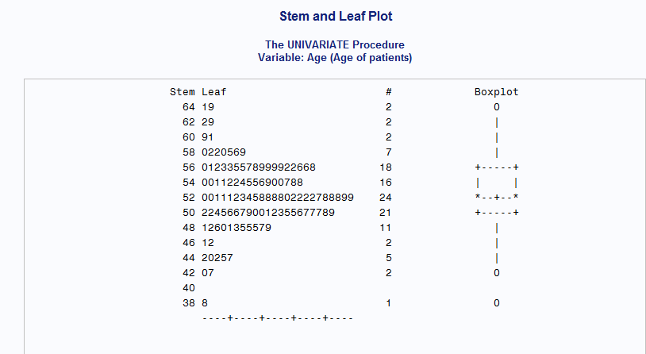
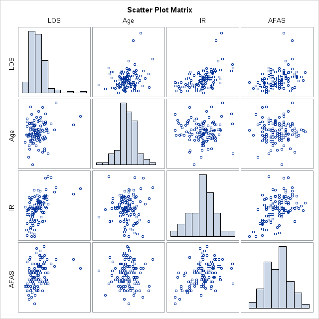
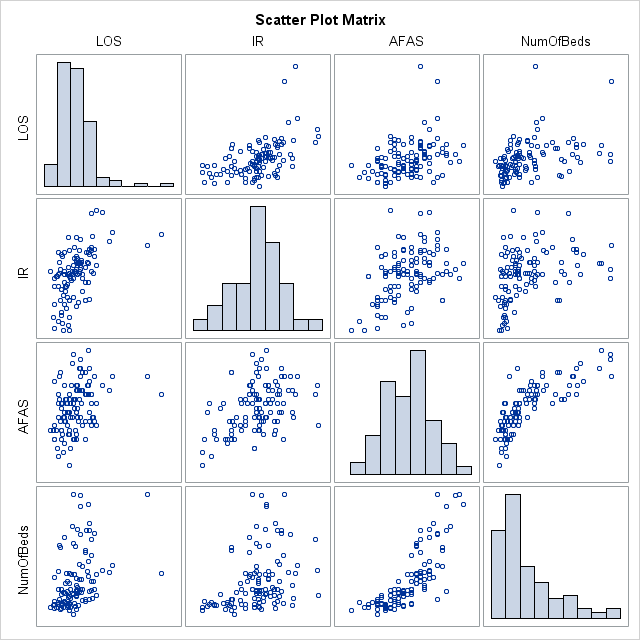

```{r setup, include=FALSE,warning=FALSE,message=F}
knitr::opts_chunk$set(echo = FALSE, comment = NA,warning=FALSE,message=F,fig.height = 5)
library(markdown)
library(knitr)
library(xtable)
library(hwriter)
library(dplyr)
library(magrittr)
library(purrr)
library(readr)
```

## Problem 1

```{r}
mat1 <- matrix(data=c(1,0,1,0,2,2,1,2,3),nrow=3,ncol=3,byrow=T)
#kable(mat1,format='markdown',row.names = F, col.names=rep('',3))
```

###(i) Is the matrix of full rank?

Performing elementary row reduction on $A = \begin{bmatrix}
1 & 0 & 1\\
0 & 2 & 2\\
1 & 2 & 3
\end{bmatrix}$

$$\begin{matrix}
\\
\xrightarrow{r_2/2}\\
\xrightarrow{r_3 - r_1}
\end{matrix} \begin{bmatrix}
1 & 0 & 1\\
0 & 1 & 1\\
0 & 2 & 2
\end{bmatrix}$$

$$\begin{matrix}
\\
\\
\xrightarrow{r_3 - 2r_1}
\end{matrix} \begin{bmatrix}
1 & 0 & 1\\
0 & 1 & 1\\
0 & 0 & 0
\end{bmatrix}$$

and counting the number of non-zero rows gives a rank of 2. Also, computing the determinant of the matrix $A$,

$$1\left|\begin{array}{cc}
2 & 2\\
2 & 3
\end{array}\right| - 0\left|\begin{array}{cc}
0 & 2\\
1 & 3
\end{array}\right| + 1\left|\begin{array}{cc}
0 & 1\\
0 & 2
\end{array}\right| = 0 $$

The two approach showed that the matrix is not of full rank since the matrix has $rank =$ `r qr(mat1)$rank` which does not span the maximum space in dimension, which is 3. Also, the determinant of the matrix is `r det(mat1)` which implies that one of the rows of the matrix is linearly dependent on another row (row3 = row2 + 1), leading to the same conclusion that the matrix is not of full rank.

###(ii) Determine the eigenvalues and eigenvectors

To obtain the eigen values of the matrix $A$, the equation $|A - \lambda I_{3}| = 0$ is solved. $\lambda$ is scalar and $I_{3}$ is a $(3 \times 3)$ identity matrix and $0$ is a $(3 \times 1)$ column vector. Solving the system;

$$\left|\begin{array}{ccc}
1 & 0 & 1\\
0 & 2 & 2\\
1 & 2 & 3
\end{array} - \begin{array}{ccc}
\lambda & 0 & 0\\
0 & \lambda & 0\\
0 & 0 & \lambda
\end{array}\right| = 0$$

results into the equation $\lambda (6\lambda - \lambda^2 - 6)= 0$ which results in the roots $0$, $3 + \sqrt{3}$ and $3 - \sqrt{3}$. Therefore, the eigen values of the matrix are; `r round(eigen(mat1)$values,3)` and solving the system $(A - \lambda I_3)X = 0$ for each lambda gives the eigen vectors which are;

$$(0.5774, 0.5774, -0.5774) \ \ \ \text{for} \ \ \ 0$$,
$$ (0.2114, 0.5774, 0.7887)  \ \ \ \text{for}  \ \ \ 3 + \sqrt{3}$$ and
$$(0.7887, -0.5774, 0.2114)  \ \ \ \text{for}  \ \ \ 3 - \sqrt{3}$$.


```{r} 
#kable(eigen(mat1)$vectors,format='markdown',row.names = F,col.names = rep('',3))
```

Since the determinant of the matrix is 0 and it is as well symmetric, the product of the eigen values should be 0, i.e. $\prod_{i=1}^{3} \lambda_{i} = 0$ and the sum of the eigen values should give 6 (trace of the matrix), i.e. $\sum_{i=1}^{3} \lambda_{i} = 6$. $0 \times (3 + \sqrt{3}) \times (3 - \sqrt{3}) = 0$ and $0 + (3 + \sqrt{3}) + (3 - \sqrt{3}) = 6$ which validates lemma 2(i).

###(iii) Check for the validity of Lemma 2(iii)

Lemma 2(iii) is valid if $UDU^{-1} = A$ where $U$ is the eigen vector of the matrix A, $U^{-1}$ is the inverse of the eign vectors of the matrix A and D is a diagonal matrix of the eigenvalues of A.  $$U = \left( \begin{array}{ccc}
0.2113 & 0.7887 & 0.5774\\
0.5774 & -0.5774 & 0.5774\\
0.7887 & 0.2113  & -0.5774
\end{array} \right)$$
$$D = \left( \begin{array}{ccc}
4.732 & 0.000 & 0.000\\
0.000 & 1.268 & 0.000\\
0.000 & 0.000 & 0.000
\end{array} \right)$$ and $$U^{-1} = \left( \begin{array}{ccc}
0.2113 & 0.5774 & 0.7887\\
0.7887 & -0.5774 & 0.2113\\
0.5774 & 0.5774 & -0.5774
\end{array} \right)$$

Multiplying the matrix, gives;

$$\left( \begin{array}{ccc}
0.2113 & 0.7886751 & 0.5774\\
0.5774 & -0.5773503 & 0.5774\\
0.7887 & 0.2113  & -0.5774
\end{array} \right) \times \left( \begin{array}{ccc}
4.732 & 0.000 & 0.000\\
0.000 & 1.268 & 0.000\\
0.000 & 0.000 & 0.000
\end{array} \right) \times \left( \begin{array}{ccc}
0.2113 & 0.5774 & 0.7887\\
0.7887 & -0.5774 & 0.2113\\
0.5774 & 0.5774 & -0.5774
\end{array} \right)$$

The result of the multiplication gives the matrix below which is exactly A, hence the Lemma holds.

```{r}
#kable(round(eigen(mat1)$vectors %*% diag(eigen(mat1)$values) %*% solve(eigen(mat1)$vectors),2),format='markdown',row.names = F,col.names = rep('',3))
```

###(iv) Check for the Validity of Lemma 2(iv)

rank(A) = number of nonzero eigenvalues. This lemma is true for the matrix in question as the number of non-zero eigen values is 2 which is the same as the rank of the matrix.

## Problem 2

$P = X (X'X)^{-1} X'$ is the orthogonal projection onto the column space of the design matrix which maps the vector of reponse values to the vector of the predicted values. $I_n - P$ is the orthogonal to the information contained in the design matrix. Both $P$ and $I_{n} - P$ gives the solution to the least square problem when the model matrix has linearly independent columns. Intuitively, $P$ projects the response into the plane, and it acts as an identity matrix to the design matrix $X$, since $PX = X(X'X)^{-1}X'X = X$ and $I_n - P$ on the other hand acts as a 0 matrix to X, since $(I_n - P)X = X - PX = X - X = 0$.


The property $(I_n - P)X = 0$ is also crucial to derivation of other theorem as it is used on **page 13**, **line 22** for **part III** of **theorem 5** to show that $\hat{\beta}$ and $MSE$ are independent and also on **page 14**, **line 8** for **part 4** of **theorem 5** to show that $\frac{(n-p)MSE}{\sigma^{2}} \sim \chi_{n-p}^{2}$.


## Problem 7

```{r}
hw1 <- read_table('./Data/APPENC01.txt',col_names = c('IDNUM','LOS', 'Age', 'IR', 'RCR', 'RCXR', 'NumOfBeds', 'MSA', 'Region', 'ADC', 'NumberOfNurses', 'AFAS'))
hw11 <- hw1 %>% select(LOS,Age,IR,NumOfBeds,AFAS)
#hw11 %>% select(-LOS) %>% map(stem)
```
### Correlation Matrix


## Appendix (Graphs & SAS Code)

### Stem and Leaf Plot For Predictor Variables




### Scatter Plots






